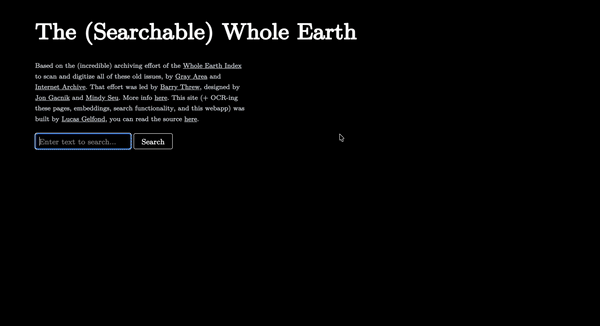

Try the demo out at [https://searchwhole.earth](https://searchwhole.earth)

Welcome to the source! This repo is broken up into three folders
- `backend/` which is a light server that embeds queries (with Together.ai) and makes calls out to Turbopuffer, which I use for the db here
- `frontend/` which is a Svelte client / interface for search and navigation around the issues.
- `processing/` which has all of the ephemeral scripts I used to process  and scrape data here. You can read [`processing/README`](./processing/README.md) for some more of the design decisions/approach here. 

The frontend is deployed on Cloudflare Pages and backend on Cloudflare Workers through the GitHub Actions on here.

Thanks again to [Barry Threw](https://barrythrew.com/) and [Hannah Scott](https://hannahmscott.github.io/) at Gray Area for their help, and much credit to [Jon Gacnik](https://jongacnik.com/) and [Mindy Seu](https://mindyseu.com/) for their design on the original site, [wholeearth.info](https://wholeearth.info/). 

I started building this when I lived in San Francisco, and finished it up after my move to New York.  I always found the Whole Earth Catalog fascinating insofar as it was a nexus of Bay Area [counterculture and cyberculture](https://press.uchicago.edu/ucp/books/book/chicago/F/bo3773600.html) and was a huge part of my [reverence](https://lucasgelfond.online/san-francisco) for Northern California when I lived there. I hope you enjoy exploring around! 